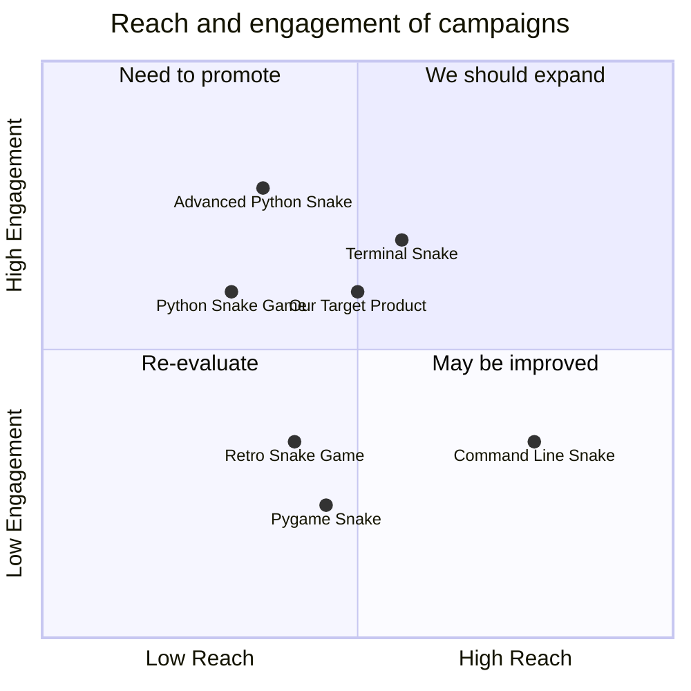

## Original Requirements
The boss has asked for a command-line based snake game using pygame.

## Product Goals
```python
[
    "Create a simple, easy-to-play command-line snake game",
    "Ensure smooth gameplay with no lag or glitches",
    "Incorporate basic features such as scoring and game over conditions"
]
```

## User Stories
```python
[
    "As a user, I want to be able to easily start a new game",
    "As a user, I want the game to respond quickly to my commands",
    "As a user, I want to see my score as I play",
    "As a user, I want the game to end when the snake hits the border or itself",
    "As a user, I want to be able to restart the game once it's over"
]
```

## Competitive Analysis
```python
[
    "Python Snake Game: A simple, command-line based game with basic features",
    "Pygame Snake: A more complex version with additional features such as power-ups",
    "Terminal Snake: A terminal-based game with a focus on minimalism",
    "Command Line Snake: A game with a unique twist - it's entirely text-based",
    "Retro Snake Game: A game that emulates the classic Nokia snake game",
    "Advanced Python Snake: A game with advanced features such as AI opponents"
]
```

## Competitive Quadrant Chart


## Requirement Analysis
The product should be a command-line based snake game using pygame. The game should include basic features such as scoring and game over conditions. The game should respond quickly to user commands and allow the user to easily start a new game or restart once the game is over.

## Requirement Pool
```python
[
    ("Implement basic game mechanics (snake movement, eating, growing)", "P0"),
    ("Implement scoring system", "P0"),
    ("Implement game over condition (snake hits border or itself)", "P0"),
    ("Ensure smooth and responsive gameplay", "P0"),
    ("Implement game start/restart functionality", "P1")
]
```

## UI Design draft
The game will be command-line based, so the UI will be text-based. The snake and food will be represented by different characters. The score will be displayed at the top of the screen. The game over message will be displayed in the center of the screen, along with the option to restart.

## Anything UNCLEAR
There are no unclear points.