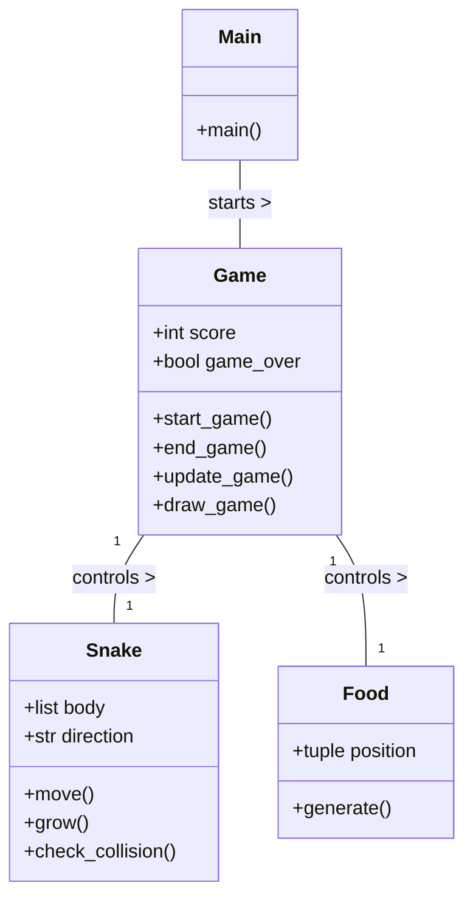
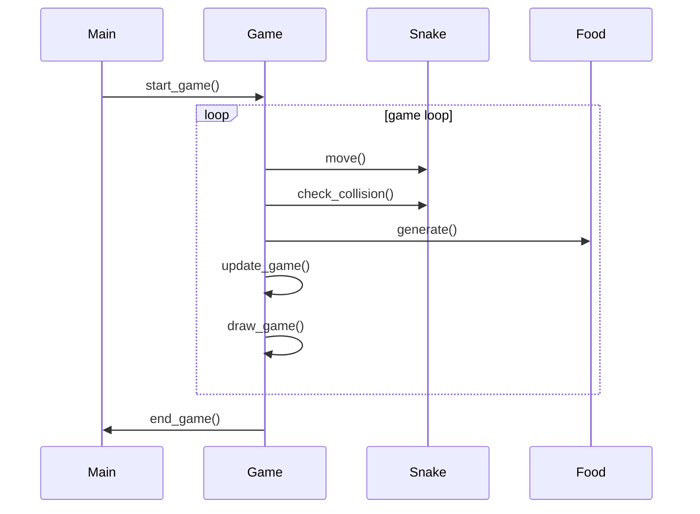

## Implementation approach
We will use Pygame, an open-source library for making video games in Python. The game logic will be implemented in a Game class, which will handle the game loop, user input, and game over conditions. The Snake and Food classes will be responsible for their respective functionalities. The game will be rendered in a terminal window using characters to represent the snake, food, and borders. The game speed will be controlled to ensure smooth and responsive gameplay.

## Python package name
```python
"cli_snake_game"
```

## File list
```python
[
    "main.py",
    "game.py",
    "snake.py",
    "food.py"
]
```

## Data structures and interface definitions


## Program call flow


## Anything UNCLEAR
The requirement is clear to me.